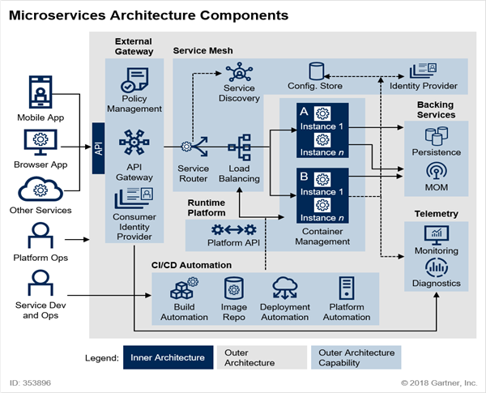

# MicroService 와 Spring Cloud
- Microservice 란?
- Microservice와 SOA
- Spring Cloud란?
- 필수 SW 설치

 

## Software Arcitecture
### IT System이 발전되어 온 과정
- 1960s ~ 1980s : Fragile(깨지기 쉬운 시스템), Cowboys
  - Mainframe 시대, 하드웨어(높은 비용)가 중심이 되는 시대
- 1990s ~ 2000s : Robust, Distributed
  - 분산화된 서비스로 안정적이고 높은 서비스를 제공하기 시작
- 2010s ~ : Resilient/Anti-Fragile, Cloud Native
  - 확장성, 안정성 강화, 탄력성! Devops 문화 등장
  - Anti-Fragile : 다른 개발 시스템/환경에 비해 시스템 변화가 적고 변화에 바로 적응할 수 있고 , 비용이 저렴한 특성이 있다.

 

### Antifragile 특징
- AutoScaling  
  - 자동 확장성을 갖는다는 특징이다. 
  - 시스템을 구성하고 있는 인스턴스를 하나의 AutoScaling 그룹으로 묶어서 그룹에서 유지되어야 하는 최소 인스턴스 지정할 수 있고 사용량에 따라 자동으로 인스턴스를 증가할 수 있는 환경.
  - 관리자나 운영자에 의해 처리되는 것이 아니라 CPU, 메모리, 네트워크, DB 사용량이나 조건에 따라 자동으로 처리할 수 있다.
- Microservices 
  - Cloud Native Architecture , Cloud Natvie Application의 핵심
  - 기존 시스템들이 하나의 거대한 형태로 구축되어 서비스되었다고 하면 Microservice는 전체 서비스를 구축하고 있는 개별 모듈이나 기능을 독립적으로 개발하고 배포하고 운영할 수 있도록 세분화된 서비스.
- Chaos engineering 
  - 시스템이 급격하고 예측하지 못한 상황에도 견딜 수 있고, 신뢰성을 갖기 위해 운영중인 소프트웨어의 시스템의 실행 방법 혹은 규칙이다.
  - 시스템의 변동, 예견된 불확실성, 예견되지 않는 불확실성, 카오스 불확실성에 대해 안정적으로 서비스를 제공할 수 있도록 구축되어야 한다는 것을 의미
- Continuous deployment
  - CI/CD와 같은 배포 파이프라인
  - CI/CD는 지속적인 통합, 지속적인 배포!
  - Cloud Native Application은 작게는 수십개, 많게는 수백개 이상의 microservice로 도메인이 분리되어 개발되는 경우가 일반적이다.
  - 수백개의 microservice를 빌드,테스트,배포 작업을 수작업으로 한다면 작업시간이 심하게 지체될 수 있다. 
  - 이를 해결하기 위해 자동화된 시스템구축이 필요하고, 하나의 작업에서 다른 작업으로 연계되는 과정을 파이프라인으로 연결시켜놓으면 작은 변화 뿐만 아니라 전체적인 시스템 업그레이드 작업에서도 빠르게 적용 가능하다.

 

## Cloud Native Architecture
### 확장 가능한 아키텍처
- 시스템의 수평적 확장에 유연
- 확장된 서버로 시스템의 부하 분산, 가용성 보장
  - 시스템 확장을 위한 Scaling은 Scale-up (하드웨어 사양을 높인다.) , Scale-out( 같은 사양의 서버(인스턴스)를 여러대 배치 )가 있다.
  - 일반적으로 하드웨어 비용이 증가하지만 Cloud Native Architecture에서는 cloud를 제공하는 업체로부터 가상의 서버, 가상의 스토리지, 가상의 네트워크를 빌려서 사용함으로써 비용 최소화, 반납이 가능한 구조가 되었다.
- 시스템 또는 서비스 애플리케이션 단위의 패키지 (컨테이너 기반 패키지)
- 모니터링

 

### 탄력적 아키텍쳐
- 서비스 생성-통합-배포, 비즈니스 환경 변화에 대응 시간 단축 
  - CI/CD 자동화 파이프라인을 통해 처리
- 분할된 서비스 구조
  - 전체 어플리케이션을 구성하는 도메인 특성에 따라 서비스 경계를 구분하고 개발해야 한다.
  - 서로 분리된 서비스 간의 원활한 통신을 위해 각각의 서비스는 종속성을 최소화 시켜야 한다.
  - 상태를 갖지 않는 서비스를 제공하도록 노력해야 한다.
  - 전체 어플리케이션을 구축하는 microservice들은 자신들이 배포될 때 자신의 위치를 등록해서 다른 서비스, 외부 시스템에서 검색해서 사용할 수 있다.
- 무상태 통신 프로토콜 
- 서비스의 추가와 삭제 자동으로 감지
- 변경된 서비스 요청에 따라 사용자 요청 처리(동적 처리)

 

### 장애 격리
- 특정 서비스에 오류가 발생해도 다른 서비스에 영향 주지 않음
  - 장애 복구에 뛰어나다.

 

## Cloud Native Applcation
- Cloud Native Architecture에 의해 설계되고 구현되는 Application
  - Cloud Native ARchitecture의 특징, Anti-Fragile 의 특징을 갖는다.

 

### Cloud Native Applcation 구현 형태
1. Microservice로 개발된다.
2. CI/CD 시스템에 의해 자동 통합, 빌드, 테스트, 배포 과정을 거친다.
3. DevOps, Microservice에 문제 발생시 바로 수정하여 다시 배포하는 과정을 반복하는 형태를 갖는다.
4. Containers, 하나의 어플리케이션을 구성하는 Microservice들을
 Cloud 환경에 배포하고 사용하기 위해 Container 가상화 기술을 사용한다.

 

### Cloud Native Applcation 특징
- CI/CD
  - 지속적인 통합(Continuous Integration)
    - 하나의 어플리케이션을 여러 팀, 여러 개발자가 개발될 때 결과물을 통합되기 위한 형상 관리를 뜻할 수도 있고, 통합된 코드를 빌드하고 테스트하는 과정 자체를 뜻하기도 한다.
    - 통합 서버, 소스 관리(SCM), 빌드 도구, 테스트 도구
    - ex) Jenkins, Team CI, Travis CI
  - 지속적인 배포
  - CD는 두가지 의미가 있다. ( 지속적인 전달, 지속적인 배포 )
    - Git과 같은 소스 저장소에 업로드된 코드를 패키지화 된 형태의 결과물을 실행환경에 어떻게 배포하는지에 따라 달라진다.
    - Continuous Delivery (CD) : 패키지화된 결과물을 실행환경에 수작업 배포하는 과정이 필요한 경우
    - Continuous Deployment (CD) : 운영자, 관리자의 개입없이 실행환경까지 자동화되어 있는 경우
    - Pipe Line 
  - 카나리 배포와 블루그린 배포 ( 배포 전략 )
    - 카나리 배포 : 전체 사용자의 95%사용자가 이전 버전의 서비스를 사용하게 하고, 5%의 사용자만이 새로운 버전의 서비스를 사용하게 한다.
    - 블루그린 배포 : 이전 버전(블루)의 사용자 트래픽과 거의 동일하게 점진적으로 새버전(그린) 서비스를 채택한다.
- Devops ( Development + Operations )
  - 개발 조직과 운영 조직의 통합을 의미하며 이를 통해 고객의 요구사항을 빠르게 반영하고 만족도 높은 서비스를 제공하고자 한다.
  - 개선사항, 오류사항 관련을 필요에 따라 바로 반영, 수정할 수 있다.
  - 고객의 요구사항에 맞는 에러 없는 프로덕트를 완성하기 위해 자주 테스트, 피드백, 업데이트 과정을 거쳐 지속적으로 개발과정이 진행된다.
  - Cloud Native Application은 Devops환경에 맞춰 서비스 단위를 작은 단위로 나눠 더 자주 통합, 테스트, 배포하는 구조가 될 수 있다.
- Container 가상화
  - Cloud Native Architecture의 핵심
  - Cloud 환경으로 이전함으로써 적은 비용으로 탄력성 있는 시스템을 구축하게 되었다.
  - 하드웨어 가상화, 서버 가상화에 비해 적은 리소스를 사용하여 가상화 서비스를 구축할 수 있다.
   
    - 전통적인 방식 : hw위에 운영체제, app 운영 방식
    - 하드웨어 가상화 방식 : 운영체제 위에 Hypervisor, 위에 가상머신(시스템이 가지고 있는 물리적인 하드웨어 - post system을 쪼개서 사용하는 개념) 가동해서 독립적인 운영체제를 가지고 실행될 수 있다. 즉, 각각의 가상머신에 application을 운영할 수 있다. 단, post 운영체제에 많은 부하를 주고, 확장에 한계가 있다.
    - Container 가상화 : 운영체제 위에 Container 가상화를 기동하기 위한 소프트웨어 서비스를 작동하고 컨테이너 가상화에서는 공통적인 라이브러리, 리소스를 공유해서 사용한다. 각자 필요한 부분에 대해서만 독립적인 영역에서 실행할 수 있는 구조이다. 더 적은 리소스를 사용하고, 서비스들은 가볍고 빠르게 운영할 수 있다는 특징을 가지고 있다.

 

## 12 Factors
Cloud Native Application을 구축함에 있어서 고려해야 할 12가지 항목

1. 코드 베이스 – Base Code
   - 자체 Repostory에 저장된 각 Microservice에 대한 단일 코드베이스를 뜻함. 
   - 버전 제어, 형상 관리가 주 목적이다.
   - 이후 배포하기 위해 코드의 통일된 관리가 중요하다.
2. 종속성(의존성) 배제 – Dependency Isolation
   - 각 Microservice는 자체 종속성을 가지고 패키지되어 있기 때문에 전체 시스템에 영향을 주지 않는 상태로 변경되고 수정될 수 있어야 한다.
3. 환경 설정의 외부관리 - Configurations
   - 구성 정보, 코드 외부에서 구성 관리 도구를 통해 Microservice에 필요한 작업을 제어하는 것이다.
   - 동일한 배포가 올바른 구성이 적용된 환경에서 전파될 수 있다.
4. 서비스 지원 – Linkable Backing Services
   - 보조 서비스 (DB,Cahce,Broker 등)를 이용하여 Microservice가 가져야 할 기능을 추가로 지원한다.
   - 프로그램에서 필요한 Backing System Resource를 분리함으로써 서로 코드 Dependecy를 갖지 않게 된다. 
5. 빌드,릴리즈, 실행 환경 분리 – Stages of Creation
   - 필요한 상태에 대해 개발 서버에서 만들어진 코드를 배포하기 위해 실행 단계까지 옮기는 과정을 엄격하게 분리해야 한다.
   - 고유한 ID로 태그를 가져야 하며, rollback 기능을 지원해야 하며, CI/CD 시스템을 이용한 자동화된 서비스를 구축해야 한다.
6. 상태관리 프로세스 (stateless 프로세스) – Stateless Processes
   - 각각의 Microservice는 실행중인 다른 service와 분리되어 자체 process에서 운영될 수 있어야 한다. (독립성)
   - 하나의 Microservice는 다른 Microservice와 분리되어 독립적으로 실행될 수 있는 상태여야 한다.
   - 필요한 자원이 있다면 Cache, Data Store를 통해 외부와 데이터 동기화를 한다. 
7. 포트 바인딩 – Port Binding
   - 각각의 Microservice는 자체 포트에서 노출되는 인터페이스 및 기능과 함께 자체 포함되어 있는 기능이 있어야 한다.
   - 다른 Microservice와의 격리를 위함이다.
8. 동시성 - Concurrency
   - Microservice는 아주 많은 수의 service를 동일한 process를 복사해서 확장해나간다.
   - 하나의 service가 여러개의 인스턴스에 동일한 형태로 복사되어 운영됨으로써 부하분산을 이루어낸다. (동시성을 갖는다.)
9. 폐기 가능 – Disposability
   - service 인스턴스 자체가 삭제가 가능해야 한다.
   - 확장성 기회를 높여야 한다.
   - 정상 종료를 할 수 있는 상태여야 한다.
10. Development 단계와 Production 단계 구분 – Development & Production Parity
    - 응용 프로그램의 수명주기 전반에 걸쳐 최대한 많은 서비스 access를 방지해서 다른 작업과 종속적이지 않은 상태를 유지해야 한다.
11. 로깅 - Logs
    - Microservice에 의해서 생성된 로그를 이벤트 스트림으로 처리해야 한다.
    - 하나의 시스템 안에서 구성되고 있는 로그를 출력하는 로직은 기존의 어플리케이션 로직과 분리되어 어플리케이션이 실행되지 않는 상태더라도 로그는 정상적으로 작동하는 상태여야 한다.
    - 이를 위해 별도의 서비스, 모니터링 도구를 사용할 수 있다.
12. Admin 프로세스 – Admin Processes For Eventual Processes
    - 현재 운영되고 있는 모든 Microservice들을 어떤 상태로 사용되며, 리소스가 사용되는 것을 파악하기 위한 적절한 관리도구가 필요하다.
    - 리포팅 기술이 포함되어야 하며, 데이터 정리 및 데이터 분석 기술이 포함될 수 있따. 

### Pivotal의 + 3 Factors

2. API first
   - 모든 Microservice는 API 형태로 서비스가 제공되어야 한다.
   - API 구축시 사용자가 어떤 형태로 사용하는지 먼저 고려해야 한다.
14. Telemetry
    - 모든 지표는 수치화, 시각화되서 관리되어야 한다. 
15. Authentication and authorization
    - API를 사용함에 있어서 인증이 필수여야 한다.
    - Microservice가 분리되어 있는 상태로 개발된다고 하더라도 구현하는 Microservice는 적절한 인증을 가지고 있는 리소스, 서비스,외부시스템에서 데이터를 전달, 교환이 가능해야 한다.

 

## Monolithic vs Microservice
시스템을 구축하고 운영하는 방식

### Monolithic
- 어플리케이션 개발에 필요한 모든 요소를 하나의 소프트웨어 안에 포함시켜 개발하는 방식
- DB 로직, 비즈니스 로직, 화면 처리 모두 하나의 어플리케이션 안에서 유기적으로 연결되어 작동하고 있고, 서로 의존성을 가진 상태로 패키징되어 운영서버에 배포된다. 

### Monolith Architecture
- 모든 업무 로직이 하나의 애플리케이션 형태로 패키지 되어 있는 서비스
- 애플리케이션에서 사용하는 데이터가 한곳에 모여 참조되어 서비스되는 형태
- 시스템 일부만 수정하더라도 전체 어플리케이션을 빌드, 테스트, 패키징 해야한다는 단점을 가지고 있다.

 

### Microservice
- 어플리케이션을 구성하는 각각의 구성요소 및 서비스의 내용을 분리해서 개발하고 운영하는 방식
- 유지보수, 변경사항 적용에 유리하다.
- 독립적으로 수정, 배포할 수 있게 되면서 어플리케이션 전체가 다운타임이 되는 것을 막을 수 있다.
- 각각의 용도에 맞는 컨테이너를 모아서 사용하는 서비스 개념

### Monolith Architecture
- 함께 작동하는 작은 규모의 서비스들
  - 출처 : Building Microservices - Sam newman 
- Monolith Architecture은 http를 이용해 Resorce API 통신할 수 있는 작은 규모의 서비스들의 모임을 통해 하나의 어플리케이션을 구성한다.
- 비즈니스 기능을 중심으로 구축되어야 한다.
- 완전 자동화된 배포 시스템을 이용해야 한다.
- 각각의 서비스는 최소한의 중앙집중식 관리가 되어야 한다.
- 서로 다른 프로그래밍 언어와 서로 다른 데이터 저장 기술을 사용할 수 있다.
- 하나의 서비스를 구성하는 크기가 도메인의 특성을 고려해서 경계를 구분하고 구분된 서비스는 독립적인 언어와 독립적인 db를 사용할 수 있다.
- 즉, Microservice는 개발 언어와 DB를 전체 어플리케이션을 통일하는 것이 아닌 각각의 서비스별로 최적화된 언어와 DB를 사용하는 것을 권장한다.

 

### Monolithic vs Front&Back vs Microservice
- 하나의 어플리케이션에 모든 로직과 서비스가 포함되는 Monolithic 방식
- 사용자에게 화면을 보여주고 어떤 액션을 처리받도록 하는 프론트 부분과 서버 사이드 부분을 구분하는 Front & Back 방식
  - 서로 필요한 부분만 통신하여 각각 최적화된 개발환경을 독립적으로 유지할 수 있다.
- BackEnd의 각 서비스를 서로 의미있는 경계로 구분하는 것을 더한 MSA 방식
  - 서비스 요청에 대한 통일된 gateway, 서비스들의 등록,검색, 부하분산, 문제 발생시 대처법, 분리된 서버들의 데이터 동기화 메커니즘이 필요할 것이다.

 

## Microservice Architecture 란?

### Microservice의 특징
1. Challenges : 개발의 패러다임을 바꾸어야 한다. 독립적으로 배포가능한 형태의 작은 서비스로 이루어져 있다.
2. Small Well Chosen Deployable Units : 독립적으로 배포가능한 형태의 작은 서비스로 이루어져 있다.
3. Bounded Context : 각 서비스의 경계가 잘 구분되어야 한다.
4. RESTful : 서로 Rest API로 통신해야 한다. (Http 기반 JSON 포맷 통신)
5. Configuration Management : 환경, 설정 정보는 외부의 시스템을 통해 관리한다. ( 하드 코딩해야 하는 정보 관리 - IP 주소, 특정 값 등 )
6. Cloud Enabled : Cloud Native 기술을 이용하여 서비스를 제공한다.
7. Dynamic Scale Up And Scale Down : 인스턴스는 부하분산처리, Scale-up, Scale-down을 동적으로 처리할 수 있도록 구성해야 한다.
   - Microservice 하나의 서비스가 다른 서비스를 조작하고 사용함으로써 전체 애플리케이션을 구성할 수 있고, 하나의 서비스에서 하나의 시스템 또는 인스턴스만 직접 서비스되는 것이 아니라 여러개의 분산된 형태로 서비스될 수 있다.  
8. CI/CD : 서비스가 묶여 하나의 어플리케이션으로 작동하므로 자동화 배포가 중요하다.
9.  Visibility : Microservice들을 시각화할 수 있는 관리도구를 포함해야 한다.

### Microservice Architecture 도입시 고려사항
Q1 ) Multiple Rates of Change
- 도입했을 때 어느 정도의 공수를 받아들일 수 있을 것인가
  
Q2 ) Independent Life Cycles
- 각 서비스들이 독립적으로 개발되고 운영될 수 있도록 서비스 경계가 만들어져 있는가

Q3 ) Independent Scalability
- 서비스들의 유지보수성, 확장성이 잘 고려되었는가

Q4 ) Failure Isolation
- 각 오류들이 잘 격리되고 독립적인가

Q5 ) Simplify Interactions with External Dependencies
- 외부 종속성과의 상호 작용을 단순화해 종속성을 줄이고 내부 응집도는 높여야 한다.

Q6 ) Polyglot Technology
- 각 서비스들에 맞는 여러가지 언어, DB, 운영환경 등을 자유롭게 선택하여 사용할 수 있는가

 

## SOA vs MSA
### Service Oriented Architecture vs Microservice Architecture
- 서비스를 지향한다는 공통점
- SOA : 재사용을 통한 비용 절감이 주 목적
  - 서비스 공유 최대화
  - 기술 방식 : 공통의 서비스를 ESB(서비스 버스 - WSDL/UDDI/ESB )에 모아 사업  측면에서 공통 서비스 형식으로 서비스 제공
- MSA : 서비스 간의 결합도를 낮추어 변화에 능동적으로 대응하려는 목적
  - 서비스 공유의 최소화
  - API를 통해 데이터를 요청하고 사용해야 한다.
  - Microservice에 문제가 생기더라도 다른 Microservice에 직접적인 영향을 주지 않고 우회할수 있는 서비스로 구현된 것
  - 기술 방식 : 각 독립된 서비스가 노출된 REST API를 사용

### REST API
### 성숙도 모델 : REST API를 개발할 때 확인, 고려할 내용
- Level 0
  - 가장 기본적인 단계
  - 기존의 리소스를 웹서비스 상태로 제공하기 위해 url만 매핑한 형태
- Level 1
  - 외부로 공개하고자 하는 리소스를 의미있고 적절한 URI로 표현
  - 적절한 패턴을 가지고 작성되었지만 http 메소드 별로 서비스를 구분해서 사용하지는 않는다.
  - 사용자의 요청을 단순히 GET/POST로 처리, 모든 반환값에 대해 에러코드, 200(OK) 코드를 반환하는 경우
- Level 2
  -  Level 1 + HTTP Method 의 형태
  -  제공하고자 하는 리소스를 적절한 용도와 상태에 따라 HTTP Method에 맞게 설계, 서비스하는 단계
  -  리소스가 읽기 용도의 데이터일 경우 GET, 새로운 리소스 추가 POST, 기존 리소스 변경 PUT, 삭제 DELETE Method를 이용하여 서비스의 상태 표현
  -  비슷한 이름의 URI이더라도 HTTP Method에 따라 다른 형태의 서비스를 제공할 수 있다.
- Level 3 
  - Level 2 + HATEOAS 의 형태
  - 데이터를 가지고 다음 작업에서 어떠한 Action을 할 수 있는지 상태 정보를 함께 보낸다.
  - 리소스를 적절한 상태로 표현하고, 다음 작업을 어떻게 하는지에 대한 모든 정보를 알려주는 기능인 HATEOAS가 포함된다.
  - 클라이언트는 서버가 제공하는 서비스를 하나하나 찾아야 하는 수고를 겪지 않을 수 있다.
  - EndPoint를 통해 다음 URI를 알 수 있는 상태가 된다.

### RESTFul Web Service 고려사항
- Consumer first : 소비자는 API를 사용하는 또다른 시스템, 개발자를 위해 간단명료하고 직관적인 API를 설계해야 한다.
- Make best use of HTTP : HTTP Method, Request, Response, Header 등 HTTP 장점을 살려서 개발해야 한다.
- Request methods : 적절한 HTTP Method(GET/POST/PUT/DELETE)를 이용하여 Level 2 성숙도 모델 이상으로 지켜야 한다.
- Response Status : API 요청에 맞게 적절한 상태코드가 전달되어야 한다. 
- No secure info in URI : URI에는 sercure 정보를 포함하지 않는다.
- Use plurals : 단수 보다 복수 형태의 값을 사용하여 제공한다.
- User nouns for resources : 동사보다 명사 형태로 표시하여 사용자에게 직관성 제공한다.
- For exceptions : 일관적인 end point 사용하는 것이 좋다. 진입점 단일화 (API Gateway) 를 활용하는 것이 포함된다.

 

## Microservice Architecture Structures
### MSA Compnoents 구성 예

- Microservice는 독립적으로 배포, 확장될 수 있는 서비스를 조합해서 하나의 애플리케이션을 구성하는 아키텍쳐 패턴이다.
- Microservice를 지원하고 관리하기 위해 Service Discovery, API Gateway, Ocastration, Context Boudery 등의 서비스를 연계해서 사용한다.
- CNCF에서는 각 시스템과 시스템을 구성하는 서비스 별로 CNCF의 솔루션, 기술을 소개하고 있다. 

 

## Spring Cloud란?

